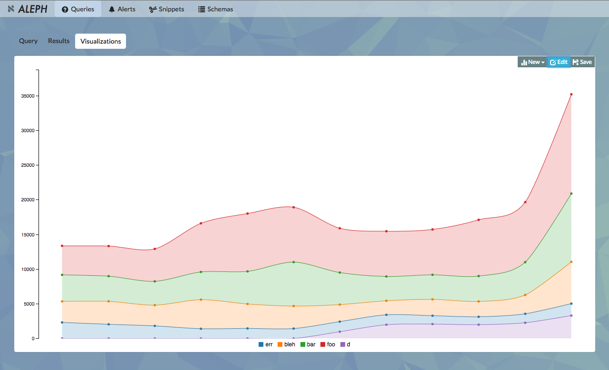

# Aleph
Aleph is a Redshift analytics platform that focuses on aggregating institutional data investigation techniques.

- [Introduction](http://engineering.lumosity.com/aleph)
- [Demo](http://aleph-analytics.io) / [Video](https://www.youtube.com/watch?v=I5N7Xr-NVcU)
- [Help](https://groups.google.com/forum/#!forum/aleph-user)

## Quickstart
If you want to connect to your own Redshift cluster, the follow instructions should get you up and running.

### Docker Install
The fastest way to get started: [Docker](https://docs.docker.com/mac/step_one/)

###### Configure your Redshift and run

      docker run -ti -p 3000:3000 lumos/aleph-playground /bin/bash -c "aleph setup_minimal -H {host} -D {db} -p {port} -U {user} -P  {password}; redis-server & aleph run_demo"

###### Open in browser

      open http://$(docker-machine ip):3000

### Gem Install

You must be using [PostgreSQL 9.2beta3 or later client libraries](https://kkob.us/2014/12/20/homebrew-and-postgresql-9-4/)

###### Install and run Redis

    brew install redis  && redis-server &

###### Install gem

    gem install aleph_analytics

###### Configure your Redshift and run

    aleph setup_minimal -H {host} -D {db} -p {port} -U {user} -P {password}
    aleph run_demo

Aleph should be running at `localhost:3000`

## Aleph Gem
Aleph is packaged as a [Rubygem](https://rubygems.org/gems/aleph_analytics).

To list gem executables, just type `aleph --help`

Find out more about the gem executables [here](docs/GEM_EXECUTABLES.md).
## Installation

### Dependencies
For a proper production installation, Aleph needs an external Redis instance and operational database. The locations of these services can be configured using [environment variables](docs/ENVIRONMENT_VARIABLES.md). More detailed instructions on configuration can be found [here](docs/ADVANCED_CONFIGURATION.md). Example configurations can be found [here](config/example).

### The app
There are a number of ways to install and deploy Aleph. The simplest is to set up a Dockerfile that installs aleph as a gem:

    FROM ruby:2.1.6

    # we need postgres client libs
    RUN apt-get update && apt-get install -y postgresql-client --no-install-recommends && rm -rf /var/lib/apt/lists/*

    # make a log location
    RUN mkdir -p /var/log/aleph
    ENV SERVER_LOG_ROOT /var/log/aleph

    # make /tmp writeable
    RUN chmod 777 /tmp

    # bundle install inside the aleph gem
    RUN gem install aleph_analytics

    # copy our aleph configuration over to the image
    ENV ALEPH_CONFIG_PATH /etc/aleph/
    COPY aleph_config/. /etc/aleph/.

    # install the aleph dependencies
    RUN aleph deps

You can then deploy and run the main components of Aleph as separate services using the gem executables:

- web_server - `aleph web_server --worker-process 2`
- query workers - `aleph workers`  
- clock (used to trigger alerts) - `aleph clock`  

At runtime, you can inject all the secrets as environment variables.

We *highly* recommend that you have a git repo for your queries and s3 location for you results.

Advanced setup and configuration details (including how to use Aleph roles for data access, using different auth providers, creating users, and more) can be found [here](docs/ADVANCED_CONFIGURATION.md).

## Contribute
Aleph is Rails on the backend, Angular on the front end. It uses Resque workers to run queries against Redshift. Here are few things you should have before developing:

* Redshift cluster
* Postgres and Redis installed
* Git Repo (for query versions)
* S3 Location (store results)

While the demo/playground version does not use a git repo or S3, we *highly* recommend that you use them in general.

### Setup
*Postgres*

    createuser -s -P postgres
    initdb --encoding=utf8 --auth=md5 --auth-host=md5 --auth-local=md5 --username=postgres --pwprompt /usr/local/var/postgres
* development password should be "password"
* Restart Postgres

*Database*

    bundle exec rake db:create db:migrate
    RAILS_ENV=test bundle exec rake db:setup db:test:prepare

*Karma/Jasmine*

    npm install

### Testing

    RAILS_ENV=test bundle exec rspec spec
    bundle exec rake karma:run

### Running

    bundle exec foreman start
You can manage your env variables in a .env file

## Links

- [Feature Notes](docs/FEATURES.md)
- [Rubygem](https://rubygems.org/gems/aleph_analytics)
- [aleph-user group](https://groups.google.com/forum/#!forum/aleph-user)

Unless otherwise noted, all Aleph source files are made available under the terms of the [MIT License](https://github.com/lumoslabs/aleph/blob/master/LICENSE)
